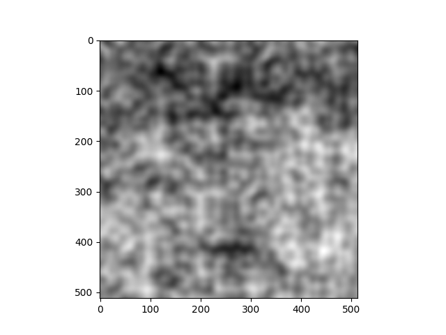

# Fractal Noise

A Python implementation for Fractal Noise. Generates intricate fractal noise patterns to add naturalistic complexity for a wide range of creative applications. Ideal for creating realistic terrain, cloud-like texture, and visual effects.

## Features

- **Create complex fractal noise**: Generate complex and naturalistic fractal noise patterns.
- **Fine-tune control**: Adjust width, height, scale, and octaves to customize the appearance of the fractal noise.
- **Scalable coordinate space**: Flexible and unlimited coordinate space.

## Examples

```python
from fractal_noise import get_fractal_noise
import matplotlib.pyplot as plt

width, height = 512, 512
scale = 0.1
octaves = [0, 1, 2, 3, 4, 5]

# Generate fractal noise
noise = get_fractal_noise(width, height, scale, octaves)

# Display
plt.imshow(noise, cmap="gray")
plt.show()
```


